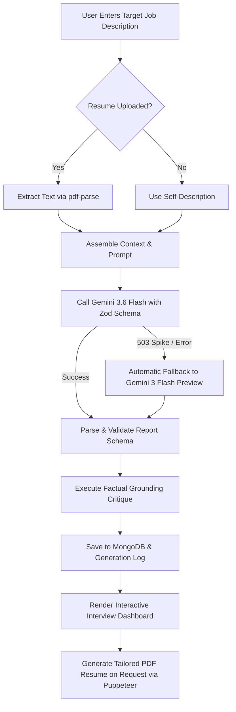

# Interview Master 🎯

> An intelligent, end-to-end AI interview preparation platform. Analyze target job descriptions, evaluate resume alignment, identify critical skill gaps, practice tailored technical & behavioral questions with model answers, follow a day-by-day study roadmap, track progress analytics, and download an ATS-optimized tailored resume PDF.

---

## 🌟 Key Features

### 🧠 1. Comprehensive AI Interview Strategy
- **Role Match Score (0–100%)**: Instant visual assessment of how strongly your background matches the target role.
- **Categorized Skill Gaps**: Highlights missing competencies labeled by impact severity (`low`, `medium`, `high`).
- **Targeted Technical Questions**: Realistic engineering questions with interviewer intentions and recommended model answers.
- **Behavioral Questions**: Scenario-based questions with structured STAR-method guidance.
- **Multi-Day Preparation Roadmap**: Day-by-day focus areas with concrete, actionable study tasks and milestones.

### 🛡️ 2. Factual Grounding & Confidence Checks
- Secondary AI grounding critique evaluates whether generated questions and skill gaps are factually supported by the candidate's resume and target JD.
- Displays confidence percentages (e.g. `92% grounded`) and warns users on ungrounded items.

### ⏳ 3. Dynamic Multi-Stage Waiting Experience
- Replaces static loading text with an interactive waiting screen during the 20–30s generation:
  - **Live 6-Stage Progress Pipeline**: Automatically steps through *Parsing Profile*, *Evaluating Match*, *Generating Q&As*, *Behavioral Prep*, *Building Roadmap*, and *Finalizing*.
  - **Animated AI Core**: Concentric counter-rotating orbital rings with glowing radial pulses.
  - **Smooth Gradient Progress Bar**: Live progress percentage with real-time elapsed timer (`⏱ Xs elapsed`).
  - **Rotating Interview Tips Ticker**: Cycles through high-yield interview tips (STAR method, system design constraints, impact metrics).

### 📄 4. Interactive Resume Upload & Validation
- **Drag-and-Drop Dropzone**: Drag and drop PDF resumes directly or browse with file chooser.
- **Real-Time File Card**: Displays file name, human-readable size (e.g. `245 KB`), a green `✓ Attached` badge, and an instant `✕ Remove` button.
- **Format & Size Guards**: Enforces PDF format and up to 10MB limits (client-side and Multer middleware).
- **Live Character Counter**: Real-time counter for the target job description.

### 📥 5. Tailored Resume PDF Generation & Download
- Generates an ATS-friendly, beautifully formatted resume in HTML/CSS specifically tailored to the target job description.
- Converts to an A4 PDF using Puppeteer in headless mode.
- Non-blocking button feedback: Transitions to `Generating PDF...` with spinner, downloads the file automatically, and displays a green `✓ Downloaded!` confirmation without resetting the page.

### 👍 6. Question Feedback & Analytics Dashboard
- **Feedback**: Rate individual technical and behavioral questions with thumbs up / thumbs down.
- **Analytics (`/analytics`)**:
  - Interactive SVG line chart showing match score trends across generated reports.
  - Frequency distribution chart of top recurring skill gaps across applications.

### 🔒 7. Secure Authentication & History
- Secure registration and login using JWT stored in `httpOnly` cookies.
- Password hashing with `bcryptjs`.
- Server-side token blacklisting upon logout.
- Persistent report history saved to MongoDB and viewable from the home page.

---

## 🛠️ Tech Stack

### Frontend
- **Framework**: React 19 + React Router 8
- **Bundler & Tooling**: Vite 8 (with `@vitejs/plugin-react`)
- **HTTP Client**: Axios (configured with `withCredentials: true`)
- **Styling**: SCSS (Sass Embedded) with modular variables and theme system

### Backend
- **Runtime**: Node.js (v18+)
- **Framework**: Express 5
- **Database**: MongoDB via Mongoose 9
- **AI Integration**: Google GenAI SDK (`@google/genai`) using `gemini-3.6-flash` (with automatic fallback to `gemini-3-flash-preview` and exponential backoff retry)
- **Schema Validation**: Zod v4 with native `z.toJSONSchema()` for Gemini structured output
- **PDF Generation**: Puppeteer (headless Chrome PDF generation)
- **File Upload & Parsing**: Multer (memory storage) + `pdf-parse`

---

## 📂 Project Structure

```
interview-master/
├── Backend/
│   ├── server.js                      # Entry point: connects DB & starts server
│   ├── package.json
│   ├── scripts/
│   │   ├── benchmark-models.js        # Multi-model benchmarking script (Google & OpenAI)
│   │   └── fixtures/                  # Benchmark test resumes & job descriptions
│   └── src/
│       ├── app.js                     # Express app: CORS, JSON parser, global error handler
│       ├── config/
│       │   └── database.js            # MongoDB Mongoose connection
│       ├── controllers/
│       │   ├── auth.controller.js     # User registration, login, logout, getMe
│       │   └── interview.controller.js# Report generation, PDF resume, feedback, analytics
│       ├── errors/
│       │   └── AIGenerationError.js   # Custom error class for AI generation failures
│       ├── middlewares/
│       │   ├── auth.middleware.js     # JWT verification & blacklist check
│       │   └── file.middleware.js     # Multer 10MB PDF upload filter
│       ├── models/
│       │   ├── user.model.js          # User credentials schema
│       │   ├── blacklist.model.js     # Revoked JWT tokens
│       │   ├── interviewReport.model.js # Stored reports, grounding, and feedback
│       │   └── generationLog.model.js # Raw AI prompt & response audit log
│       ├── routes/
│       │   ├── auth.routes.js         # /api/auth endpoints
│       │   └── interview.route.js     # /api/interview endpoints
│       └── services/
│           └── ai.service.js          # Gemini structured generation, grounding, PDF rendering
└── Frontend/
    ├── index.html
    ├── vite.config.js
    ├── package.json
    └── src/
        ├── main.jsx                   # React root entry
        ├── App.jsx                    # Root component with Auth & Interview providers
        ├── app.routes.jsx             # React Router configuration
        ├── style.scss                 # Global resets and theme styles
        ├── style/
        │   └── button.scss            # Common button classes
        └── features/
            ├── auth/
            │   ├── auth.context.jsx   # Global user session context
            │   ├── hooks/useAuth.js   # Auth hook
            │   ├── components/Protected.jsx # Route guard for logged-in users
            │   ├── pages/
            │   │   ├── Login.jsx      # Login page
            │   │   └── Register.jsx   # Registration page
            │   └── services/auth.api.js
            └── interview/
                ├── interview.context.jsx # Global interview state & download tracker
                ├── hooks/useInterview.js # Report generation, PDF download, and feedback hook
                ├── components/
                │   └── LoadingScreen.jsx # Dynamic 6-stage animated waiting screen
                ├── pages/
                │   ├── Home.jsx       # Job & resume input with drag-and-drop
                │   ├── Interview.jsx  # 3-column interactive strategy viewer
                │   └── Analytics.jsx  # Match trends & skill gaps charts
                ├── services/interview.api.js # API communication with blob error handling
                └── style/
                    ├── home.scss
                    ├── interview.scss
                    ├── analytics.scss
                    └── loadingScreen.scss
```

---

## ⚙️ Prerequisites

1. **Node.js**: v18.0.0 or higher
2. **MongoDB**: Local MongoDB community instance or [MongoDB Atlas](https://www.mongodb.com/atlas)
3. **Google GenAI API Key**: Obtain a free API key from [Google AI Studio](https://aistudio.google.com/apikey)
4. *(Optional)* **OpenAI API Key**: If running the model benchmark comparison script

---

## 🔑 Environment Configuration

Create a `.env` file inside the `Backend/` directory:

```env
# MongoDB Connection String
MONGO_URI=mongodb://localhost:27017/interview-master
# Or MongoDB Atlas:
# MONGO_URI=mongodb+srv://<username>:<password>@cluster.mongodb.net/interview-master

# JWT Secret for Session Cookies
JWT_SECRET=your-secure-random-secret-key-at-least-32-chars

# Google GenAI API Key
GOOGLE_GENAI_API_KEY=your-google-ai-studio-api-key

# Optional: For benchmark-models script
# OPENAI_API_KEY=your-openai-api-key
# OPENAI_MODEL=gpt-4o-mini

# Optional: Puppeteer Chromium path override (if needed in headless Linux environments)
# PUPPETEER_EXECUTABLE_PATH=/usr/bin/google-chrome-stable
```

The frontend connects to `http://localhost:3000` by default (defined in `Frontend/src/features/interview/services/interview.api.js`). CORS is configured in `Backend/src/app.js` to allow `http://localhost:5173` with credentials.

---

## 🚀 Installation & Running

### 1. Start the Backend API

```bash
cd Backend
npm install
npm run dev
```
> The API server will start on **`http://localhost:3000`** with nodemon.

### 2. Start the Frontend Application

In a separate terminal:

```bash
cd Frontend
npm install
npm run dev
```
> The client development server will start on **`http://localhost:5173`**.

---

## 📡 API Reference

All `/api/interview` routes are protected and require a valid JWT cookie set via login.

| Method | Endpoint | Description | Auth Required |
| :--- | :--- | :--- | :---: |
| `POST` | `/api/auth/register` | Register a new user account | No |
| `POST` | `/api/auth/login` | Log in and receive `token` httpOnly cookie | No |
| `GET` | `/api/auth/logout` | Log out and blacklist current token | Yes |
| `GET` | `/api/auth/get-me` | Get current logged-in user profile | Yes |
| `POST` | `/api/interview/` | Generate a new interview report (`multipart/form-data`) | Yes |
| `GET` | `/api/interview/` | List all historical reports for logged-in user | Yes |
| `GET` | `/api/interview/report/:interviewId` | Retrieve full interview report by ID | Yes |
| `POST` | `/api/interview/resume/pdf/:interviewReportId` | Generate & stream tailored resume PDF | Yes |
| `POST` | `/api/interview/report/:interviewId/feedback` | Submit thumbs up/down rating on a question | Yes |
| `GET` | `/api/interview/analytics` | Get match score trends & top skill gap counts | Yes |

---

## 📊 Model Benchmarking

Interview Master includes a built-in benchmarking tool to test and compare AI model latency, schema validation compliance, and keyword grounding against fixture datasets.

To run the benchmark:

```bash
cd Backend
npm run benchmark
```

The script evaluates fixtures from `Backend/scripts/fixtures/` and outputs a formatted table comparing latency (ms), schema validation success, and grounding score, saving detailed results to `Backend/scripts/benchmark-results.json`.

---

## 🔄 Generation Workflow



---

## 🛡️ License

This project is licensed under the ISC License.
